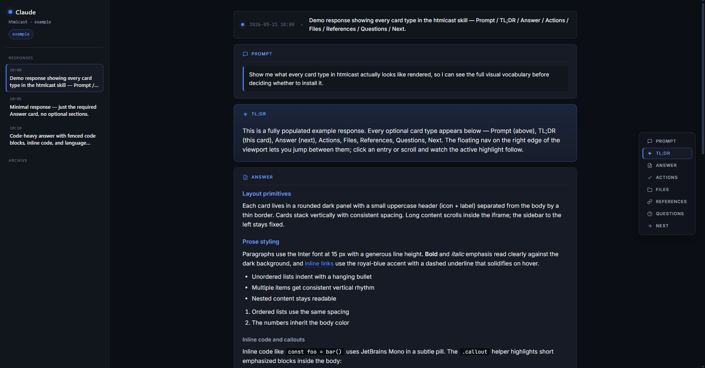

<div align="center">


### ✨ *Stop scrolling Claude. Start reading it.* ✨

Cast Claude Code's substantive answers to a live-reloadable HTML page on a second monitor —
so they're easier to read, scan, and come back to than wall-of-text terminal output.

<p>
  <a href="LICENSE"></a>
  <a href="https://www.anthropic.com/claude-code"></a>
  <a href="#install"></a>
  
</p>



</div>

---

## ✨ Features

- 🎯 **Smart triggering** — short answers stay in your terminal, substantive ones go to HTML
- 🎨 **Card-based UI** — Prompt · TL;DR · Answer · Actions · Files · References · Questions · Next
- 🧭 **Floating section nav** — scroll-spy + click-jump for fast in-page navigation
- ⚡ **Live reload** — `live-server` refreshes the browser on every new response
- 🪶 **Zero clutter** — one hidden `.htmlcast/` directory, dot-prefix keeps it out of sight
- 🎛️ **Customizable styles** — edit `.htmlcast/base.css` per project, or globally in the skill
- 🌑 **Dark theme by default** — royal-blue accent, warm-orange for questions, JetBrains Mono for code

## Why

The seed of this idea, from Andrej Karpathy on X:

> This works really well btw, at the end of your query ask your LLM to "structure your response as HTML", then view the generated file in your browser.
>
> More generally, imo audio is the human-preferred input to AIs but vision (images/animations/video) is the preferred output from them. Around a ~third of our brains are a massively parallel processor dedicated to vision, it is the 10-lane superhighway of information into brain. As AI improves, I think we'll see a progression that takes advantage:
>
> 1. raw text (hard/effortful to read)
> 2. markdown (bold, italic, headings, tables, a bit easier on the eyes) ← current default
> 3. HTML (still procedural with underlying code, but a lot more flexibility on the graphics, layout, even interactivity) ← early but forming new good default
>
> […] For what's worth exploring at the current stage, hot tip try ask for HTML.

Same instinct, different shape. We're visual learners — raw terminal text is harder than it should be to absorb, even when the answer is good. There's a real subconscious tax to scrolling walls of prose; reading the same content as structured cards on a second monitor lowers that tax and (at least for me) makes the answer feel more substantial, easier to scan, easier to come back to. This skill is a small bet that turning Claude's substantive responses into visually structured HTML makes them genuinely easier to use, not just prettier.

## What it does

- Active only in projects with a `.htmlcast/` directory in the project root (hidden, dot-prefixed — never clutters your file tree).
- Each substantive Claude response is rendered as a self-contained HTML page in `./.htmlcast/responses/`.
- The terminal gets a one-line stub: `✓ <summary> — see browser`.
- `live-server` watches the folder and auto-reloads the browser on each write.
- A floating right-side nav lets you jump between sections of the current response (Prompt / TL;DR / Answer / Actions / Files / References / Questions / Next) and tracks your scroll position.
- Short confirmations and one-line answers still print normally in the terminal.

## Install

### One-step install

**macOS / Linux / Git Bash on Windows**

```bash
git clone https://github.com/rmarinic/claude-htmlcast.git
cd claude-htmlcast
./install.sh
```

**Windows PowerShell**

```powershell
git clone https://github.com/rmarinic/claude-htmlcast.git
cd claude-htmlcast
./install.ps1
```

This copies `skill/` → `~/.claude/skills/htmlcast/` and `command/htmlcast-init.md` → `~/.claude/commands/htmlcast-init.md`. Re-run it any time to update.

### Live-server (one time, global)

You also need `live-server` on your `PATH`:

```bash
npm install -g live-server
```

## Quick start

In any project you want to view:

```
# 1. Initialize (creates the hidden .htmlcast/ directory + scaffolds it)
/htmlcast-init

# 2. In a separate terminal, start the live viewer
live-server .htmlcast/
```

That's it. From now on, when Claude gives a substantive answer in this project, you'll see it in the browser. Short answers still come back in the terminal.

To stop using htmlcast in a project, delete the `.htmlcast/` directory.

## How it works

Two-pane layout. A sticky sidebar lists every response (newest at top); the content pane is an `<iframe>` that loads one response file at a time. Each file in `.htmlcast/responses/` is a fully self-contained HTML page (doctype, head, body, SVG defs, the response card, and the floating section nav). Clicking a sidebar link swaps the iframe's source — no fetch, no fragment injection, no race against live-server.

For the card-type reference see [docs/CARD_TYPES.md](docs/CARD_TYPES.md).

## File layout

After install:

```
~/.claude/skills/htmlcast/
├── SKILL.md
├── assets/
│   ├── base.css
│   └── nav.js
└── templates/
    ├── template-index.html
    └── template-response.html

~/.claude/commands/
└── htmlcast-init.md
```

After running `/htmlcast-init` in a project:

```
<project-root>/
└── .htmlcast/                  # hidden directory; presence activates the skill
    ├── index.html              # skeleton (sidebar + iframe)
    ├── base.css                # copy of skill asset — restyle here per-project if you want
    ├── nav.js                  # copy of skill asset
    ├── responses/
    │   └── r-YYYY-MM-DD-HHMMSS.html
    └── archive/
```

One hidden folder, that's it — no marker file alongside, no clutter at the top level of your project.

## When does Claude write HTML?

Claude decides per response based on a smart-trigger heuristic:

| Response type                                          | HTML? |
|--------------------------------------------------------|-------|
| "Committed and pushed", "Tests pass", "Installed X"    | no    |
| Single-line factual answer                             | no    |
| Yes / no / one-word confirmation                       | no    |
| Anything <3 sentences with no code, questions, files   | no    |
| Explanation of what was done and why                   | yes   |
| Multi-step analysis, planning, reasoning               | yes   |
| Code blocks with surrounding commentary                | yes   |
| Question back to the user requiring a decision         | yes   |
| Response that generated files (images, configs)        | yes   |
| Multiple sections, lists, formatted content            | yes   |

See `skill/SKILL.md` for the full rules.

## Try it without installing

Open `example/.htmlcast/index.html` in a browser to see a fully populated view with a representative response. No install required, no live-server needed for the preview — just double-click `index.html`.

## Customizing the look

Edit `.htmlcast/base.css` in your project (the copy made by `/htmlcast-init`). All visual rules — sidebar, cards, code blocks, the floating nav, scrollbars — live there. The next response Claude writes picks up the new styles on live-server's reload.

To change the look globally for all future projects, edit `skill/assets/base.css` and re-run `install.sh` / `install.ps1`.

## Troubleshooting

- **Nothing appearing in the browser:** confirm `.htmlcast/` exists in the project root (Claude only activates when it sees that directory). Confirm `live-server` is pointed at `.htmlcast/`, not the project root.
- **Browser shows a blank page:** check that `.htmlcast/index.html` exists. It's created by `/htmlcast-init` — if you skipped that, run it now.
- **Sidebar entries don't highlight as current:** the iframe's `pathname` is read by a tiny script in `index.html`; if you opened `index.html` directly via `file://` it may be blocked by same-origin rules. Use `live-server` (which serves over HTTP) instead.
- **Images aren't loading:** path resolution is relative to `.htmlcast/responses/`. Use `../` to reach the `.htmlcast/` folder and `../../` to reach the project root.
- **Card not appearing for a short response:** that's the smart-trigger behavior. Short responses stay in the terminal by design.

## License

MIT — see [LICENSE](LICENSE).
